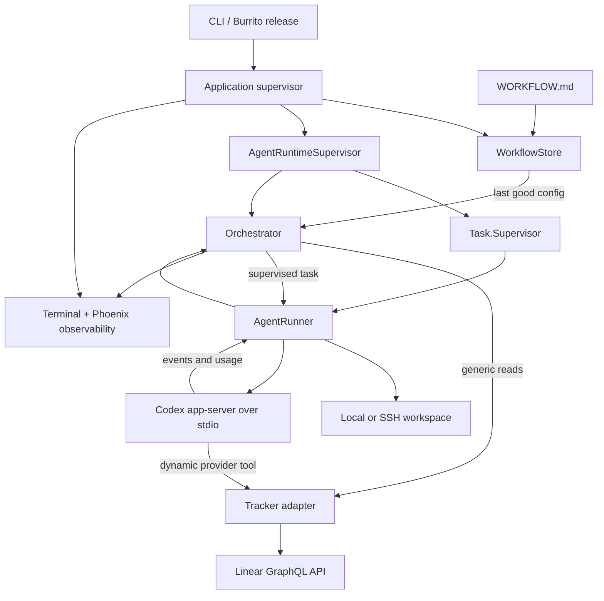
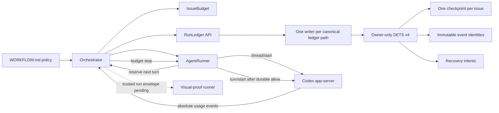
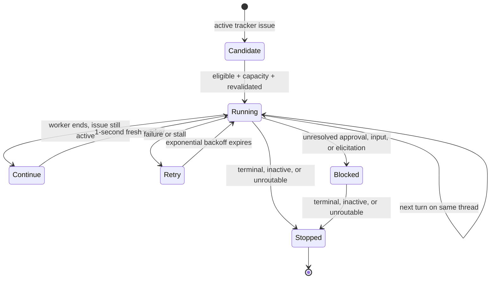

# Architecture and operating boundaries

This document first describes the pinned OpenAI upstream baseline, then records the current
Bethoven delta. Keeping those two layers explicit prevents a local experiment from being mistaken
for an upstream guarantee.

## System shape

Symphony's Elixir reference implementation is a single-node OTP daemon. Its orchestrator is the
only scheduling authority and keeps claims, running work, blocked work, retries, polling deadlines,
and aggregate token totals in memory. The surrounding supervisors restart the runtime as a unit,
but they do not persist its state. [E-003](EVIDENCE.md#e-003)

## Bethoven delta under validation

Bethoven preserves the single scheduler authority and adds a local durability/circuit-breaker
layer around it:

The durable layout retains exact event identity for the life of the ledger while bounding only the
small display history inside each issue checkpoint. A write records an intent, checkpoint, identity,
and intent cleanup with sync boundaries. Any uncertain boundary latches recovery; normal loads and
new appends fail closed until the exact event is recovered. Unknown or legacy schema, malformed
semantic state, illegal lifecycle transitions, state-root replacement, symlinked roots, and
hard-linked ledger leaves are rejected.

The orchestrator restores issue projections and aggregate totals on restart. It rejects stale run
events, snapshots the strictest persisted/current budget, gates new dispatch, schedules wall-time
deadlines, and terminates hot workers at token or other lifetime ceilings. After `thread/start`
provides the thread identity, the bound worker must synchronously persist `turn_reserved` before the
app-server receives `turn/start`; reservation failure therefore fails closed before model work.
Runtime metadata from the resulting session does not increment the durable turn count a second
time. Budget exhaustion is a durable local blocked state; a generic scheduler-owned tracker
transition is still absent. [E-022](EVIDENCE.md#e-022)

Important boundaries remain:

- DETS and the writer registry provide one-writer safety inside one BEAM node, not distributed
  multi-node execution. Run only one service per state root; no cross-process lease exists.
- Root and leaf identity are checked before each public writer request, but DETS offers no
  descriptor-bound operation, so a narrow userspace check/use window remains.
- Explicit relative `state.root` values resolve from the selected workflow directory. First binding
  writes and syncs a private temporary marker, publishes it with an atomic no-overwrite hard link,
  removes the temporary name, and directory-syncs the result. The root marker completes before its
  global workflow anchor. Partial temporary writes and crashes before or after either publication
  boundary retry toward the same mapping; conflicting published data still fails closed. There is
  no automated state-root migration command.
- Immutable event identities grow for the ledger lifetime; display-history retention is bounded,
  dedupe storage is not.
- The installed Codex app-server reports absolute usage updates but offers no verified final-usage
  query. Shutdown records an `unreconciled` marker instead of inventing a final total.
- Visual proof is a separate optional subsystem. It compares repository fingerprints before and
  after capture, but a narrow sample-to-manifest timing window and mutate-then-restore changes are
  not remote attestation. Scheduler injection, a checkout-bound app-launch receipt, retention
  cleanup, and a live Linear canary remain gates before unattended publication.

The detailed sections below return to the **pinned upstream baseline**. They intentionally describe
what Bethoven is changing; the implemented Bethoven delta and its remaining limits are the section
above.

### Upstream ownership boundaries

| Owner | Authoritative for | Not authoritative for |
|---|---|---|
| Tracker | Issue intent, state, labels, relations, human decisions | Worker liveness and local files |
| Orchestrator | Current claims, capacity, retries, reconciliation, live totals | Durable history after process restart |
| `WORKFLOW.md` | Scheduler config, workspace hooks, Codex command/policy, prompt | In-flight session mutation after reload |
| Workspace | Persistent issue files and repository state | Tracker truth and execution history |
| Codex thread | Conversation state within one worker invocation | Cross-worker continuity at this baseline |
| Adapter tool | Provider-specific mutations requested by the agent | Generic scheduler semantics or mutation safety guarantees |

## Startup and supervision — pinned upstream

The root supervisor starts PubSub, `WorkflowStore`, the agent runtime, optional HTTP, and the
terminal dashboard. `AgentRuntimeSupervisor` uses a `:one_for_all` strategy around a
`Task.Supervisor` and the orchestrator: if either fails, both restart. The service can reconstruct
eligible work from the tracker and retained workspaces, but exact claims, retry deadlines, blocked
sessions, session IDs, and token totals are lost. [E-003](EVIDENCE.md#e-003),
[E-008](EVIDENCE.md#e-008)

## Poll, dispatch, and reconciliation — pinned upstream

Each scheduling tick performs this sequence:

1. Load the last valid effective workflow configuration.
2. Reconcile running and blocked issue IDs against the tracker.
3. Validate that required configuration is available.
4. Fetch candidate issues in configured active states.
5. Sort by priority and age, then filter labels, dependencies, claims, and concurrency.
6. Re-fetch each selected issue by ID to reduce dispatch races.
7. Start an `AgentRunner` task and register its claim.

Reconciliation stops a worker when the issue becomes terminal, inactive, unroutable, or invisible.
A terminal transition also attempts to remove the issue workspace, but cleanup failures are not
propagated or retained. If tracker refresh fails, Symphony leaves the worker running until a later
tick; tracker unavailability is not treated as proof that work should stop.
[E-004](EVIDENCE.md#e-004), [E-008](EVIDENCE.md#e-008)

`Continue` and `Retry` create new Codex threads. Their counters are scheduler attempts, not durable
issue-lifetime budgets. A blocked claim is sticky while the issue remains active; it does not
automatically resume. A routing or state change must release the claim, after which a later eligible
active transition can be dispatched again. Restart also clears the in-memory claim.

## Agent execution — pinned upstream

For each dispatched issue, `AgentRunner`:

1. Creates or reuses a deterministic workspace derived from the issue identifier.
2. Runs configured `after_create` and `before_run` shell hooks.
3. Renders the Markdown body of `WORKFLOW.md` with `issue` and `attempt` values.
4. Starts one `codex app-server` child locally or over SSH.
5. Initializes the JSON-RPC connection and calls `thread/start`.
6. Starts the first turn with the fully rendered workflow prompt.
7. Refreshes the issue after each completed turn.
8. If it remains active and the worker has turns left, sends a short continuation on the same
   thread; otherwise exits and lets the orchestrator decide what follows.

The configured `agent.max_turns` therefore limits one app-server/thread lifetime, not one issue.
There is no `thread/resume` path in the pinned implementation. [E-005](EVIDENCE.md#e-005)

## Tracker abstraction — pinned upstream

The generic scheduler sees a normalized `Tracker.Issue` and two read operations: fetch by states and
fetch by IDs. At the pinned ref, Linear is the only production adapter; the in-memory adapter is for
tests. The registry is static, so adding GitHub, Jira, or another tracker still requires code.

Provider writes intentionally live outside the scheduler interface. The Linear adapter advertises a
host-side `linear_graphql` dynamic tool to Codex. The tracker API key is removed from the child
environment, but the tool accepts raw GraphQL and arbitrary variables. It has no built-in project
scope guard, idempotency key, result-size limit, mutation retry policy, or rate-limit controller.
[E-006](EVIDENCE.md#e-006)

## Workflow, prompts, and hot reload — pinned upstream

`WORKFLOW.md` combines YAML front matter with a Solid-templated Markdown prompt. Typed front matter
controls polling, tracker credentials and states, workspaces and hooks, concurrency, Codex command,
timeouts, turns, retries, sandbox policy, SSH hosts, and observability.

`WorkflowStore` checks a content stamp every second. A valid edit becomes the effective config for
future scheduling, retries, reconciliation, hooks, and sessions. An invalid edit leaves the last
known-good config active. Existing Codex sessions are not restarted, so two workers may temporarily
run under different policy revisions. Prompt render errors fail the worker. [E-007](EVIDENCE.md#e-007)

## Workspace and VCS behavior — pinned upstream

Workspaces are stable per issue and survive non-terminal retries. Local paths are canonicalized and
must remain under the configured root. SSH execution adds host pools, affinity, and per-host
concurrency, but remote path validation is materially weaker and there is no durable host-health or
remote-workspace inventory.

Symphony itself does not clone, fetch, branch, commit, push, open a PR, or merge. Those behaviors are
implemented by trusted shell hooks and by the agent following the workflow prompt. This keeps the
kernel language- and repository-agnostic, but makes `WORKFLOW.md` executable infrastructure.
[E-008](EVIDENCE.md#e-008)

## Retry and blocking behavior — pinned upstream

- A clean worker exit while its issue remains active schedules a fresh continuation after one
  second.
- Failures use `10 seconds * 2^(attempt - 1)`, capped by configuration.
- Stalled workers are terminated and retried from the retained workspace.
- Unresolved approval, user-input, or MCP-elicitation requests create an in-memory blocked claim;
  configured auto-approvals and auto-answerable input requests continue.
- Restart clears running, retry, blocked, and token state; an active tracker issue may be dispatched
  again.

Backoff limits frequency, not cumulative spend. A silent but valid long command may also look
stalled; the real notification cadence was not verified. [E-004](EVIDENCE.md#e-004)

## Observability — pinned upstream

The implementation provides rotating logs, a terminal dashboard, Phoenix LiveView, JSON status and
issue endpoints, live turn/runtime figures, aggregate token totals, per-running-worker totals, retry
state, and the latest Codex rate-limit snapshot. These are operational views, not a durable audit
store. Completed issue/session histories, prompt versions, cached/reasoning tokens, tool-result
sizes, and quality outcomes are not retained. The issue API currently exposes an empty
`codex_session_logs` collection. [E-009](EVIDENCE.md#e-009)

## Safety boundary — pinned upstream

The project explicitly targets trusted environments. Hooks execute arbitrary local or remote shell
from repository-controlled workflow configuration. Tracker and repository content become inputs to
an autonomous coding agent. Defaults can request a workspace-write/no-network posture, but explicit
sandbox and approval policies are passed through, and the example workflow enables network access
with `approval_policy: never`.

The HTTP routes have no authentication layer in the pinned implementation, including the refresh
endpoint. Exposing the endpoint or SSH workers beyond a trusted boundary requires hardening that the
reference implementation does not provide. [E-008](EVIDENCE.md#e-008)

## Known specification and documentation gaps

| Gap at the pinned ref | Evidence | Consequence |
|---|---|---|
| Basic README run command omits the mandatory high-risk acknowledgement flag | `elixir/README.md` vs `cli.ex` | Copying the documented command fails |
| Spec says relative workspace roots resolve from the workflow file; schema does not use that directory | `SPEC.md` vs `config/schema.ex` | Relative-root behavior can differ from the spec |
| Spec lists observability front matter as a future extension, but it is implemented | `SPEC.md` vs schema/dashboard | The extension checklist is stale |
| Blocked and retry state is memory-only | spec and orchestrator | Restart can redispatch unresolved work |
| Tracker extensibility is a static registry | tracker registry | A second production provider is not plug-and-play |
| Coverage is configured at 100% while core runtime modules are excluded | `mix.exs` | The percentage is not whole-runtime coverage |

Exact paths and line ranges are in [E-010](EVIDENCE.md#e-010).

## Architectural non-goals worth preserving

The specification correctly avoids becoming a rich UI, multi-tenant platform, distributed job
scheduler, or general-purpose workflow engine. Durability, budgets, and safer tools can be added as
thin extensions around the kernel. Expanding the core abstraction before a second tracker or
measured operational need proves it would make the reference harder to understand without solving
the dominant cost and recovery failures.
