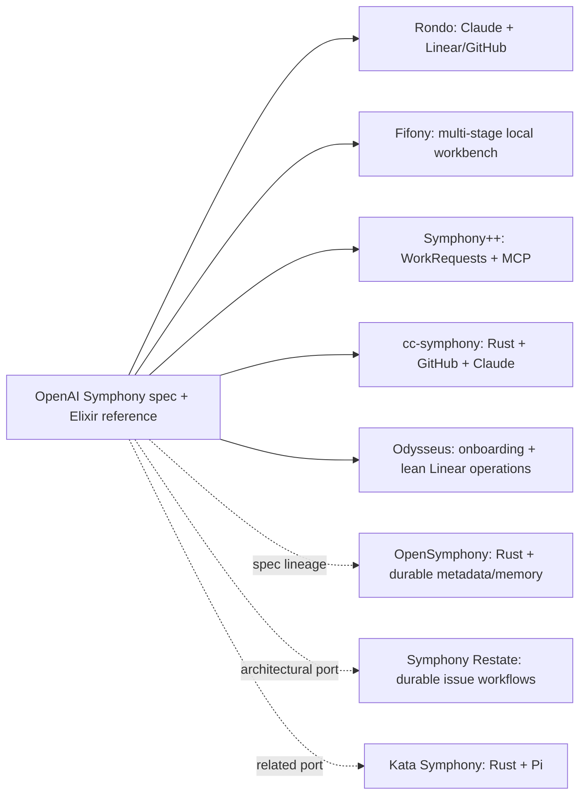

# Origin, descendants, and modern techniques

## Origin and intended legacy

OpenAI describes Symphony as the response to a work-level bottleneck: supervising several
interactive coding sessions still required a human to dispatch, monitor, and integrate them. The
tracker became the control plane and each active work item received an isolated agent loop. OpenAI
published a language-neutral draft specification and an experimental Elixir implementation, and
explicitly said it did not plan to maintain Symphony as a standalone product. The intended legacy is
the pattern and specification, not one blessed product. [E-002](EVIDENCE.md#e-002)

OpenAI reported roughly sixfold accepted-PR throughput in an internal early period. That is a
first-party operational observation, not a controlled or independently reproduced benchmark. It
should motivate measurement, not serve as our baseline.

## Lineage map

The arrows classify stated code/spec lineage, not quality or production readiness.

## Substantive descendants inspected

| Project | Classification | Distinctive inheritance or experiment | Confidence boundary |
|---|---|---|---|
| [sandsower/rondo](https://github.com/sandsower/rondo) | Direct network fork | Claude Code runtime, Linear/GitHub Issues, resumable sessions, archived runs, token tracking | Project-owned engineering-preview claims |
| [forattini-dev/fifony](https://github.com/forattini-dev/fifony) | Direct but divergent fork | TypeScript local state, worktrees, planning/approval/execution/review FSM, stage-level provider routing, recovery and cost analytics | Broader product; narrow spec conformance not established |
| [Pimpmuckl/symphony-plus-plus](https://github.com/Pimpmuckl/symphony-plus-plus) | Direct conceptual successor | WorkRequest/WorkPackage control plane, planning memory, MCP/plugin runtime, delivery evidence | Architectural divergence is intentional |
| [hawkymisc/cc-symphony](https://github.com/hawkymisc/cc-symphony) | Direct fork containing a port | Rust implementation around GitHub Issues and Claude Code | Operational maturity not independently tested |
| [bohdanpodvirnyi/symphony](https://github.com/bohdanpodvirnyi/symphony) | Maintained direct fork | GitHub Projects v2 and batched PR-feedback changes | Small footprint; no comparative benchmark |
| [odysseus0/symphony](https://github.com/odysseus0/symphony) | Direct, focused, currently stale fork | Setup skill, prebuilt narrow Linear GraphQL patterns, native Linear media flow, and file-backed `sync_workpad` tool | Four commits ahead of its fork point but 25 behind current upstream; no cost benchmark; sets `thread_sandbox` to `danger-full-access` and turn policy to `dangerFullAccess`; workpad tool lacks path containment |
| [kumanday/OpenSymphony](https://github.com/kumanday/OpenSymphony) | Greenfield spec successor | Rust, conversation rehydration, project memory, code/task/knowledge graphs, OpenHands/Codex, TUI/desktop | Substantial activity; claims remain project-owned |
| [ACNoonan/symphony-restate](https://github.com/ACNoonan/symphony-restate) | Architectural port | Per-issue durable objects/workflow journal, idempotent side effects, failover and conversation persistence | Pre-alpha; cancellation/cluster gaps documented |
| [gannonh/kata-symphony](https://github.com/gannonh/kata-symphony) | Related Rust port | Pi extension, Linear/GitHub, SSH workers, planning backend, event streaming | Relationship is project-stated; no common eval |
| [cskwork/oh-my-symphony](https://github.com/cskwork/oh-my-symphony) | Python derivative | Multiple coding backends, worktrees, admin UI/TUI, token/rate-limit views | Breadth does not establish correctness or efficiency |
| [lucasacoutinho/beethoven](https://github.com/lucasacoutinho/beethoven) | TypeScript/Bun port | Effect.TS and harness abstraction with Codex/Claude implementations | Some provider adapters are documented as stubs |

GitHub reported thousands of network forks when researched, but most were not inspected and fork
count is not evidence of independent design. The table includes only projects with explicit,
substantive documentation or implementation signals. [E-014](EVIDENCE.md#e-014),
[E-018](EVIDENCE.md#e-018)

### Adjacent, not established descendants

- [NousResearch/hermes-agent issue #404](https://github.com/NousResearch/hermes-agent/issues/404)
  proposes Symphony-style issue resolution; shipped implementation was not verified.
- Projects such as general issue-to-PR orchestrators may solve similar problems without inheriting
  Symphony's code or specification.
- Repositories with `symphony` in the name may be unrelated; name similarity is not lineage.

## What the descendants teach

Observed patterns worth testing, not copying wholesale:

1. **Durable issue identity and replay**—Restate and several broader successors treat the issue run
   as durable state instead of an in-memory worker.
2. **Harness/tracker plurality**—Rondo, Fifony, cc-symphony, oh-my-symphony, and Bethoven show that
   the tracker and coding harness boundaries are natural extension points.
3. **Explicit staged work**—Fifony and Symphony++ separate planning, approval, execution, review,
   and delivery evidence rather than placing every rule in one prompt.
4. **Conversation/artifact persistence**—Rondo and OpenSymphony preserve more than the upstream
   dashboard, but their cost/quality tradeoffs need common evaluation.
5. **Lean provider operations**—Odysseus demonstrates two useful directions: prohibit schema
   introspection by supplying narrow known queries, and send a workpad by bounded artifact reference
   instead of repeating its body in tool arguments. Its exact implementation needs path, issue, and
   size binding before reuse.
6. **Operator surfaces**—many descendants add richer UIs. Useful operations should not force the
   scheduler kernel into a product-scale control plane.

## Modern technique candidates

| Technique | Primary evidence | Symphony application | Main tradeoff |
|---|---|---|---|
| Durable execution and checkpoints | [Temporal workflows](https://docs.temporal.io/workflow-execution), [LangGraph checkpoints](https://langchain-ai.github.io/langgraph/reference/checkpoints/) | Persist claims, attempts, thread IDs, retry deadlines, side effects, and terminal reasons | Replay requires deterministic coordination and idempotent external effects |
| Structured repository memory | [OpenAI harness engineering](https://openai.com/index/harness-engineering/), [Anthropic context engineering](https://www.anthropic.com/engineering/effective-context-engineering-for-ai-agents) | Compact issue state envelope plus evidence/artifact references; promote only verified durable knowledge | Notes can drift and must never override current code silently |
| Threshold compaction | [OpenAI compaction guide](https://developers.openai.com/api/docs/guides/compaction) | Preserve contract, decisions, failures, test status, changed files; drop superseded logs and dumps | Summaries can erase constraints and add model cost |
| Token-budgeted repository map | [Aider repository map](https://aider.chat/docs/repomap.html) | Rank symbols/dependencies into a small starting map; retrieve full files just in time | Index staleness and semantic misses add tool turns |
| Stable-prefix prompt caching | [OpenAI prompt caching](https://developers.openai.com/api/docs/guides/prompt-caching) | Stable policy/tool schemas first, issue data last; measure cache fields by prompt hash | Exact-prefix churn and short sessions may erase benefit; app-server controls need detection |
| Structured handoff envelope | [OpenAI Agents SDK handoffs](https://openai.github.io/openai-agents-python/handoffs/) | Persist result, confidence, tests, decisions, blockers, next action, and artifact refs instead of transcript | A rigid or incorrect summary can propagate omissions |
| Selective decomposition | [OpenAI Symphony announcement](https://openai.com/pl-PL/index/open-source-codex-orchestration-symphony/), [Anthropic context engineering](https://www.anthropic.com/engineering/effective-context-engineering-for-ai-agents) | Create dependency-aware child issues only for independent leaves; return distilled evidence | Parallel work can multiply tokens and conflicts |
| Budget-aware routing | [RouteLLM](https://github.com/lm-sys/RouteLLM), [FrugalGPT](https://arxiv.org/abs/2305.05176) | Deterministic stage/risk routing first; learned routing only after coding-task evals | Misrouting pays for both the weak attempt and retry |
| Token-efficient tools | [SWE-agent ACI](https://github.com/SWE-agent/SWE-agent/blob/main/docs/background/aci.md), [SWE-agent paper](https://arxiv.org/abs/2405.15793) | Bounded file/search views, succinct output, stored full logs, lint-on-edit, explicit empty success | Truncation can hide the decisive error |
| Trace-based evaluation | [OpenAI agent evals](https://developers.openai.com/api/docs/guides/agent-evals), [Agents SDK tracing](https://openai.github.io/openai-agents-python/tracing/) | Compare end-to-end issue traces on success, rework, defects, tokens, cache, tools, and recovery | Traces can leak code/secrets and graders can be biased |

## Adoption rule

Adopt techniques in this order: durable ledger and handoff, complete telemetry and eval fixtures,
structured external state, bounded tool output and measured compaction, cache-friendly prompt layout,
retrieval, deterministic routing, then selective parallelism. This makes each later mechanism
observable, reversible, and comparable.

Do not enlarge the conformance core merely because a descendant implements more features. A
technique belongs in our fork only when it closes an observed failure or wins a defined experiment
without making the reference kernel opaque.
