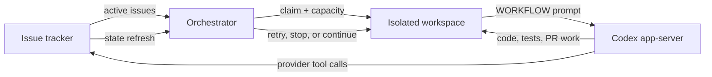

# Symphony knowledge hub

Symphony is a deliberately small, issue-driven scheduler for autonomous coding work. It turns an
issue tracker into a control plane, gives each eligible issue a deterministic workspace, runs a
Codex app-server session there, and reconciles the result with tracker state. It is a reference
kernel, not a complete autonomous software factory. [E-001](EVIDENCE.md#e-001),
[E-002](EVIDENCE.md#e-002)

## The one-minute model

At the pinned upstream baseline, the tracker owns intent and lifecycle, the orchestrator owns
temporary scheduling state, the workspace owns files, `WORKFLOW.md` owns runtime policy and the
first-turn prompt, and Codex owns the agent conversation. None of those upstream boundaries
provides durable end-to-end execution. Bethoven's current delta adds a local issue-run ledger and
issue-lifetime circuit breakers; it still does not make model calls or tracker writes exactly once.

## What it can and cannot do

| It can | It cannot, at this baseline |
|---|---|
| Poll and prioritize active issues continuously | Coordinate multiple scheduler nodes safely |
| Enforce global, per-state, and per-SSH-host concurrency | Recover exact running sessions, retry timers, or blocked claims after restart |
| Create/reuse deterministic local or SSH workspaces | Clone, sync, checkpoint, or merge repositories without workflow hooks |
| Run multiple turns on one Codex thread per worker invocation | Resume that thread in the next worker invocation |
| Reconcile workers against current tracker state | Bound total sessions, turns, tokens, or wall time per issue |
| Hot-reload typed workflow configuration with last-good fallback | Restart in-flight sessions when policy changes |
| Expose logs, dashboards, status, token totals, and rate-limit snapshots | Provide a durable per-issue cost/audit ledger or quality evaluation system |
| Read through a generic tracker seam | Use a production tracker other than Linear without new adapter code |
| Let the agent mutate Linear through a host-side GraphQL tool | Guarantee scoped, compact, idempotent, or rate-limited tracker mutations |

See [ARCHITECTURE.md](ARCHITECTURE.md) for the implementation proof and failure boundaries.

## Bethoven additions under validation

The Elixir runtime now contains a single-writer, schema-v4 DETS ledger with one current checkpoint
per issue, immutable event identities for exact replay detection, durable recovery intents, strict
lifecycle validation, owner-only state-root binding, and restart-restored aggregate accounting. The
orchestrator snapshots the strictest issue-lifetime policy and can stop dispatch or a hot run when
session, turn, token, wall-time, or consecutive-failure ceilings are reached. Values remain disabled
by default. Each turn is synchronously reserved in the ledger after `thread/start` and before
`turn/start`, so a denied or unavailable reservation cannot begin model work. Final provider usage
cannot yet be queried from the installed Codex app-server, so shutdown is recorded honestly as
unreconciled rather than guessed. See the Bethoven delta in [ARCHITECTURE.md](ARCHITECTURE.md).
[E-022](EVIDENCE.md#e-022)

This fork also contains an optional [visual proof subsystem](VISUAL-PROOF.md). It binds an issue/run
to a Git commit, executes bounded Playwright assertions, and emits a private video/trace/manifest
packet without calling a model. The runner rechecks the checkout fingerprint after browser cleanup
and refuses a manifest if the repository changed during capture. A mock Linear flow proves upload,
comment reconciliation, concurrent exclusion, and review-state transition. It is not yet wired
into the scheduler and has not performed a live Linear write. [E-021](EVIDENCE.md#e-021)

## Current thesis

Preserve Symphony's narrow issue-as-control-plane kernel. Improve it first by making work
**measurable, bounded, and recoverable**. Only then optimize context through state-specific prompts,
bounded tools, retrieval, compaction, thread resume, prompt caching, and adaptive model effort.

This ordering matters. The current `max_turns` limit bounds only one worker thread. If an issue
remains active, Symphony schedules another worker, creates a fresh thread, resends the full prompt,
and can repeat indefinitely. The largest cost risk is therefore unbounded issue lifetime, not one
overlong prompt. [E-004](EVIDENCE.md#e-004), [E-005](EVIDENCE.md#e-005)

## What we are trying to achieve

1. Every issue has a durable run identity, evidence trail, and explicit terminal reason.
2. Every issue has configurable ceilings for sessions, turns, tokens/credits, and wall time.
3. Savings are measured as **accepted, verified work per token**, not token reduction alone.
4. Agents receive only the stable policy and task context needed for the current state.
5. Expensive reasoning, large tool results, compaction, resume, and parallel subagents are invoked
   only when traces show they improve the outcome.
6. The scheduler remains understandable enough to reimplement from the specification.

The staged plan and falsifiable decision gates live in [ROADMAP.md](ROADMAP.md).

## Read next

- Need the runtime and its failure modes: [ARCHITECTURE.md](ARCHITECTURE.md)
- Need the token/cost model: [TOKEN-EFFICIENCY.md](TOKEN-EFFICIENCY.md)
- Need video review packets and their proof boundary: [VISUAL-PROOF.md](VISUAL-PROOF.md)
- Need forks and modern techniques: [ECOSYSTEM.md](ECOSYSTEM.md)
- Need the proposed direction: [ROADMAP.md](ROADMAP.md)
- Need exact sources or uncertainty: [EVIDENCE.md](EVIDENCE.md)
- Updating these documents: [AGENTS.md](AGENTS.md)

## Baseline boundary

The source analysis is pinned to upstream commit
[`7af5a764`](https://github.com/openai/symphony/commit/7af5a7648c9fbffa08825fe0c0b18be00100aff3),
two commits after release `v0.0.1`. Ecosystem and protocol research is current through 2026-07-20.
Claims about future upstream behavior, production economics, or descendant maturity are not implied.
