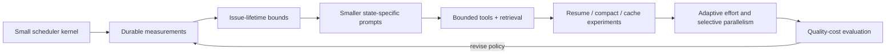

# Improvement thesis and roadmap

## Target outcome

Build a Symphony-derived orchestrator that completes verified issue-to-PR work with predictable
cost, recoverable state, inspectable decisions, and a small understandable kernel.

The primary score is **accepted, verified outcomes per token/credit and unit of human attention**.
Throughput, latency, and raw token reduction are supporting measures. A cheaper run that creates
more retries, review work, or defects is not an improvement.

## Design thesis

Keep the tracker-as-control-plane loop. Add a durable issue-run envelope and hard issue-lifetime
budgets around it. Make context progressive and tools bounded. Use resume, compaction, caching,
routing, and parallelism as measured policies—not permanent assumptions.

## Invariants

- Tracker state remains the external lifecycle truth.
- One component owns each claim and side-effect decision.
- Every external mutation has an idempotency strategy and evidence reference.
- Every retry has a cause, a cumulative budget, and a terminal escape path.
- Workspace and persisted artifacts survive ordinary retries; cleanup remains explicit.
- Policy revisions are versioned and attributable to every run.
- Safety defaults do not depend on prompt obedience alone.
- The implementation remains explainable from a compact specification.

## Non-goals

- A general workflow language or multi-tenant SaaS control plane.
- A multi-agent swarm for every issue.
- Unlimited global memory or transcript retention.
- Provider independence before two real adapters prove the abstraction.
- A rich operator UI before the underlying state and audit model are durable.
- Token savings that trade away verification quality invisibly.

## Staged roadmap

### Current implementation checkpoint

The first local slice is implemented but not yet a production claim:

- a schema-v4, single-writer issue ledger, exact event dedupe, crash intents, state-root continuity,
  strict transition validation, redaction, and restart restoration are in the working tree;
- disabled-by-default issue-lifetime ceilings for sessions, turns, tokens, wall time, and consecutive
  failures gate dispatch and hot execution, with each turn reserved durably before `turn/start`;
- deterministic browser proof, post-capture checkout revalidation, and mock Linear publication pass
  locally without model calls;
- no representative baseline/candidate ticket cohort, final provider-usage query, scheduler-owned
  tracker transition, checkout-bound launch receipt, retention job, or live Linear canary exists.

Therefore Phase 0 and Phase 1 are **partially implemented, not graduated**. The next economical step
is shadow measurement on existing work plus hostile no-model fixtures, not enabling every proposed
optimization. [E-022](EVIDENCE.md#e-022)

### Phase 0 — Establish a trustworthy baseline

Deliver:

- durable issue/run/session/turn ledger;
- canonical usage extraction and final thread reconciliation;
- prompt, model, effort, Codex version, tool-size, retry, and quality fields;
- redaction and bounded retention policy;
- replayable issue fixtures and a small real-work cohort.

Gate: two independent runs of the same fixture produce explainable ledgers, and aggregate totals
reconcile with per-issue totals within a documented tolerance.

### Phase 1 — Bound execution

Deliver:

- per-issue ceilings for worker sessions, turns, tokens/credits, wall time, and failures;
- explicit budget-exhausted/block handoff with tracker transition;
- rate-limit-aware dispatch/concurrency policy;
- idempotency keys for tracker and delivery side effects.

Gate: a deliberately non-terminating issue stops at its configured ceiling, preserves its workspace
and evidence, and cannot duplicate external mutations after restart.

### Phase 1B — Produce reviewable visual evidence

Deliver:

- a host-bound browser proof request tied to issue, run, repository commit, and workflow revision;
- objective assertions plus a short annotated video, private trace, screenshots, and hash manifest;
- strict duration, viewport, network, path, and byte bounds plus an explicit retention policy;
- a durable, journaled publication state machine that uploads only passed videos and fails closed
  when upload outcome is ambiguous;
- a Human Review transition only after artifact and comment reconciliation.

Local gate reached: the standalone `proof/` slice passes 43 deterministic fixture and mock Linear
tests with zero model calls, and its publisher rechecks host-supplied issue/run/commit/workflow/
acceptance bindings, preserves retryability for definite pre-`PUT` failures, and blocks ambiguous
post-attempt uploads. Exact comment bodies and requested review state are verified before the
journal can reach `published`. Remaining gate: inject those values from the scheduler's durable envelope,
add a host-owned launch receipt and retention job, test a real Bethoven UI change, then run one
disposable live Linear canary. [E-019](EVIDENCE.md#e-019),
[E-020](EVIDENCE.md#e-020), [E-021](EVIDENCE.md#e-021)

### Phase 2 — Reduce fixed and tool context

Deliver:

- short common contract plus state-specific workflow fragments;
- stable-prefix-first prompt layout and prompt hashes;
- one authoritative issue-context path;
- bounded common tracker tools with raw GraphQL as an audited escape hatch;
- artifact references for full logs/results outside model context.

Gate: first-turn input and p95 tool-result bytes fall materially without statistically meaningful
loss in accepted outcomes or increase in human rework.

### Phase 3 — Test continuity policies

Deliver:

- durable structured handoff envelope;
- issue-to-thread and issue-to-host metadata;
- capability-gated thread resume and compaction;
- randomized fresh-vs-resume cohorts with context-threshold policies.

Gate: select the policy by total issue cost, accepted outcome, stale-context failures, and recovery
behavior—not prompt size alone. Keep both paths if different task classes win.

### Phase 4 — Progressive repository context

Deliver:

- compact repository map with version/hash;
- just-in-time retrieval with explicit byte/token budgets;
- validation that retrieved state matches current Git and tracker state;
- structured issue artifact containing goal, decisions, changed files, tests, blockers, and next
  action.

Gate: reduce repeated file/log ingestion while keeping retrieval-miss and extra-tool-turn rates
within an agreed bound.

### Phase 5 — Adaptive execution

Deliver:

- deterministic model/effort rules by stage, risk, and repeated failure;
- optional learned routing only after sufficient labeled traces;
- dependency-aware decomposition with file ownership and child budgets;
- automatic concurrency reduction under resource pressure.

Gate: an out-of-sample evaluation shows better accepted-work-per-cost without worsening defects,
security findings, or intervention rate.

### Phase 6 — Durability and scale only as required

The current local implementation starts with DETS behind a small ledger interface. Move to SQLite,
Restate, Temporal, or another durable execution model only if multiple processes, failover, richer
queries, migration pressure, or exactly-once coordination becomes a measured requirement.

Gate: a failure-injection suite proves restart/failover behavior and idempotent side effects. Do not
pay distributed-systems complexity merely for architectural fashion.

## Hypothesis register

| ID | Hypothesis | Experiment | Evidence that rejects it |
|---|---|---|---|
| H1 | Issue-lifetime bounds remove most pathological spend | Replay known long/non-terminating fixtures with shadow caps | Cap hits are common on eventually successful work and human load rises materially |
| H2 | State-specific prompts lower total issue cost | Deterministic A/B by issue cohort | Smaller first turns are offset by more mistakes, retrieval, or retries |
| H3 | Bounded tracker tools reduce context without capability loss | Compare call/result bytes and completion outcomes | Escape-hatch use or missing-context failures remain high |
| H4 | Resume plus threshold compaction beats bounded fresh handoffs for long work | Randomized by continuation ordinal/task class | Total input, stale context, or recovery failures are worse |
| H5 | Stable prefix layout creates useful cache reuse | Record prompt hashes and cache counters | Hit rate or billed-credit benefit is negligible |
| H6 | Lower effort is sufficient for routine stages | Stage/risk routing A/B | Rework and retry costs erase reasoning savings |
| H7 | A repository map reduces repeated discovery | Compare retrieval/tool turns on fixed fixtures | Misses and index maintenance cost exceed saved context |
| H8 | Selective decomposition improves hard-task economics | Dispatch only high-independence task DAGs | Duplicate discovery, merge conflict, and synthesis cost dominate |
| H9 | Assertion-backed video packets reduce human review effort without increasing model spend | Randomize eligible UI fixtures to text evidence vs. bounded proof packets | Review time, false confidence, artifact cost, or agent-token overhead is worse |

Update this table by replacing resolved hypotheses with the next live ones. Experimental results
belong in the evidence ledger and the current thesis, not in an append-only diary.

## First implementation slice

The smallest high-leverage change set is:

1. Define the durable run-event and materialized issue-run schemas.
2. Instrument current behavior without changing dispatch policy.
3. Correct usage accounting and capture prompt/tool bytes.
4. Add issue-level session/turn/wall-time ceilings with an explicit handoff.
5. Build fixtures for endless-active, repeated-failure, restart, duplicate mutation, and normal
   completion paths.

Items 1 and 4 and part of item 3 now exist locally; representative baseline traces and final usage
reconciliation do not. Only after those traces exist should we refactor prompts or resume threads.
Otherwise we cannot distinguish a real efficiency gain from shifted or hidden work.

## Decision record policy

Current decisions live in this roadmap and the source code. When evidence reverses a decision,
rewrite the decision and cite the new evidence; rely on Git history for the superseded view. Keep a
short reason and falsifier with every active architectural choice.
