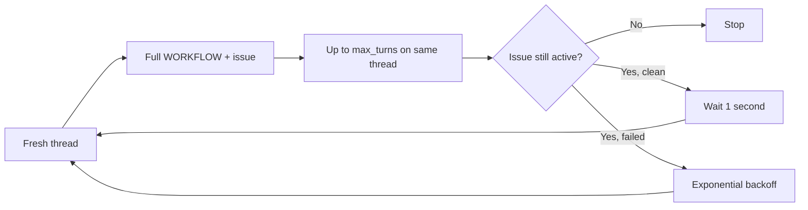

# Token and context efficiency

## Executive finding

The dominant risk is an unbounded chain of fresh sessions for one active issue.
`agent.max_turns`—20 in the example workflow—limits only one worker invocation. Normal completion
with an active issue schedules another worker after one second; the next worker starts a new Codex
thread and resends the full prompt. Failure and stall retries also start fresh threads. No
issue-level session, turn, token, credit, or wall-time ceiling exists. [E-004](EVIDENCE.md#e-004),
[E-005](EVIDENCE.md#e-005)

For issue `i`, current spend is conceptually:

`issue_tokens(i) = sum(tokens from every fresh worker session for i)`

The implementation limits terms inside one sum element, but does not limit the number of elements.

## Observed prompt baseline

At the pinned ref, the Markdown body of `elixir/WORKFLOW.md` is 18,253 bytes and 2,798 whitespace
words before issue substitution. That is not an exact model-token count. The body includes rules for
multiple tracker states, planning, workpads, validation, PR feedback, landing, rework, and blockers
even when only one path is relevant. The issue description is embedded and the agent is then told
to re-read current tracker context. The example also selects `gpt-5.5`, `xhigh` reasoning, and up to
10 concurrent agents. [E-011](EVIDENCE.md#e-011)

Within one worker, continuation prompts are short, but the thread context accumulates prior model
output, commands, tool calls, tracker responses, and the original prompt. Whether that input is
cached or billed, and how reasoning tokens map to displayed credits, is outside this repository and
was not verified.

## Cost drivers by priority

| Priority | Observed driver | Existing mitigation | Remaining failure |
|---|---|---|---|
| P0 | Unlimited fresh-session continuation while issue stays active | Per-session turn and timeout limits | No issue-lifetime circuit breaker |
| P1 | Large all-states workflow resent on every fresh thread | Short same-thread continuation prompt | Fixed repeated first-turn cost |
| P1 | Embedded issue followed by tracker re-fetch/workpad mirroring | Pre-dispatch issue revalidation | Duplicate task context and tool traffic |
| P1 | Open-ended feedback, check, landing, and rework loops | Timeouts and tracker reconciliation | Quality loops can expand context indefinitely |
| P1 | `xhigh` effort multiplied by concurrency 10 | Rate limits are displayed | No adaptive effort or dispatch gating |
| P1 | Raw GraphQL can return broad, pretty-encoded JSON | Host holds the credential | No field, page, or byte budget |
| P2 | Every failure/stall retry starts a fresh thread | Exponential backoff | Backoff slows spend but does not cap it |
| P2 | Ticket-specific data appears before much shared policy | None measured | Likely weak exact-prefix reuse |
| P2 | Usage is aggregate and memory-only | Live high-water accounting | Cannot attribute or compare completed issues |

## Measurement before optimization

Add a durable, append-only run ledger with one materialized current record per issue. At minimum,
capture:

| Dimension | Required fields |
|---|---|
| Identity | issue, run, worker invocation, thread, turn, attempt, workspace, host |
| Runtime | Symphony ref, Codex version, model, effort, service tier, policy revision |
| Prompt | workflow hash, stable-prefix hash, rendered bytes, estimated/measured tokens |
| Usage | canonical input/output/total, cached input, reasoning tokens, credits when trustworthy |
| Tools | tool name, argument bytes, result bytes, truncation, latency, side-effect key |
| Lifecycle | dispatch, retry cause/deadline, block reason, state transition, terminal reason |
| Quality | tests, review findings, human rework, accepted/merged result, escaped defect |
| Context controls | retrieval bytes, compaction count, handoff bytes, resume/fresh decision |

Current code turns absolute thread totals into live deltas, but falls back to `turn/completed` usage
even though its own accounting guide warns that generic completion usage is not necessarily a
cumulative thread total. That can undercount later turns and makes optimization claims unreliable.
Correct canonical usage extraction and reconcile final usage at thread shutdown before using the
dashboard as an experiment baseline. [E-009](EVIDENCE.md#e-009)

### Current Bethoven measurement state

The working tree now implements the first accounting guardrail rather than only proposing it. A
schema-v4 DETS ledger retains one checkpoint per issue, immutable event identities, recovery intents,
run/session/turn lifecycle, canonical absolute usage deltas, prompt byte/hash metadata, budget
policy, terminal reason, and restart-restored totals. The orchestrator enforces disabled-by-default
issue ceilings for sessions, turns, tokens, wall time, and consecutive failures. A bound worker
reserves each turn durably after `thread/start` and before `turn/start`; reaching the cumulative cap
therefore denies the provider request instead of accounting for it after spend has begun.

This is not yet a complete experimental baseline. The installed Codex app-server exposes usage
events but no verified final query, so shutdown is marked `unreconciled`. Model/effort/version,
tool-result sizes, quality outcomes, credits, and representative production distributions are still
incomplete or absent. Do not infer token savings from the existence of the ledger or from unit-test
counts. First run shadow measurement and verify that issue totals, aggregate totals, cap decisions,
and provider-reported usage converge within a documented tolerance. [E-022](EVIDENCE.md#e-022)

## Ranked experiments

### 1. Bound issue lifetime

Introduce configurable ceilings for fresh worker sessions, total turns, canonical tokens/credits,
wall time, and consecutive failures. The first implementation may leave values disabled by default,
but production rollout must define them from baseline distributions. On exhaustion, create an
explicit `budget_exhausted` handoff and pause or move the tracker item to human review; never keep
retrying silently.

Expected value: converts pathological spend from unbounded to bounded.

Falsifier: a cap causes unacceptable completion loss without isolating pathological runs. Adjust the
policy by task class; do not remove measurement.

### 2. Split stable policy from state-specific procedure

Render a short stable contract plus only the current state's instructions. Put stable safety,
verification, and tool contracts first; place issue-specific fields last. Version and hash every
rendered prompt.

Expected value: lower first-turn input and better exact-prefix cache opportunity on every session.

Risk: missing a guardrail in one state. Use snapshot tests and deterministic cohorts.

### 3. Remove duplicate issue ingress

Choose one authoritative task-context path:

- use the just-revalidated normalized issue for identity/title/body and fetch only recent comments
  or attachments; or
- omit the body from the prompt and make one bounded `get_current_issue` call.

Do not embed the full body and immediately retrieve it again by default.

### 4. Add bounded provider tools

Add narrow operations for current issue, recent comments, state transition, and workpad update with
field allowlists, compact JSON, page defaults, maximum result bytes, and idempotency keys. Retain raw
GraphQL as a visibly exceptional escape hatch.

[odysseus0/symphony](https://github.com/odysseus0/symphony) illustrates prompt-level narrow query
recipes and a body-offloaded workpad mutation, but it is not an implementation of bounded provider
tools: raw GraphQL remains host-unbounded. Its `sync_workpad` arguments contain a file path rather
than the full comment body. Do not copy it verbatim. Host-side `File.read(path)` has no workspace
containment, body-size cap, or binding between the requested issue and the running issue, and its
workflow sets `thread_sandbox` to `danger-full-access` and `turn_sandbox_policy.type` to
`dangerFullAccess`. A safe port must canonicalize beneath the current workspace, bind the issue from
trusted session state rather than model input, allow only a known workpad artifact, cap bytes, and
use an idempotency key. [E-018](EVIDENCE.md#e-018)

Expected value: fewer query-generation tokens and bounded context ingress.

Risk: truncation can hide decisive data. Return a stable artifact reference and continuation cursor
instead of silently dropping the remainder.

### 5. A/B fresh thread versus resume plus compaction

Current Codex app-server documentation and the locally generated schema for
`codex-cli 0.145.0-alpha.18` expose `thread/resume` and `thread/compact/start`; the local schema also
exposes thread goals and token budgets. These are capability evidence, not proof that resuming is
cheaper for Symphony. [E-012](EVIDENCE.md#e-012)

Persist issue-to-thread and issue-to-host affinity, then compare:

- bounded fresh threads with a compact handoff envelope; and
- resumed threads compacted at measured context/turn thresholds.

Measure total and cached input, quality, recovery failures, and spend by continuation ordinal. A
previous upstream thread-resume change was merged and reverted minutes later without a published
technical explanation, so its history is a caution, not a verdict. [E-013](EVIDENCE.md#e-013)

### 6. Add just-in-time repository context

Start with issue contract, stable policy, compact repository map, current state envelope, and
artifact references. Retrieve code, docs, and logs only when needed. Use symbol/dependency ranking
within an explicit token budget, while keeping ordinary search available when the map misses
semantic relevance. [E-016](EVIDENCE.md#e-016)

### 7. Route model effort by risk and evidence

Start with deterministic rules: lower effort for normalization, retrieval ranking, summaries, and
routine continuations; escalate for repeated failures, ambiguous architecture, security-sensitive
work, and final adversarial review. Learned routers come only after a representative labeled task
set exists.

Judge the route by accepted work per token and rework rate. A cheap attempt followed by an expensive
retry can cost more than starting strong. [E-017](EVIDENCE.md#e-017)

### 8. Make rate limits operational

Pause new workers or reduce concurrency/effort when rate-limit or credit capacity is low. Allow
useful active work to finish. This controls bursts and retry storms; it may improve reliability more
than per-issue efficiency.

### 9. Tune turn/session boundaries last

Do not simply lower `max_turns`. Under current behavior that can create more fresh threads and more
full-prompt resends. Use the ledger to find the continuation ordinal where growing history becomes
more expensive or less reliable than a fresh bounded handoff.

## Experiment scorecard

Every experiment needs both efficiency and quality outcomes:

- total tokens across every attempt and tokens per verified success;
- per-fixture spend and, only when sample size supports them, distribution percentiles;
- fresh sessions, turns, retries, compactions, and tool-result bytes per issue;
- time to verified PR and time to terminal tracker state;
- tests passed, review findings, human interventions, rework, and escaped defects;
- cap-hit, stale-context, and recovery-failure rates;
- prompt-cache hit/read/write figures where the underlying protocol reports them.

Use fixed issue fixtures plus a deterministic cohort in real work. Do not publish a savings claim
from synthetic prompt size alone.

## Cost-capped evaluation protocol

Do not apply every optimization and then compare two opaque systems. Put each change behind a
feature flag and evaluate it in dependency order: accounting, hard budgets, prompt routing, bounded
tools, workpad reference, resume/compaction, then model routing. This preserves attribution and lets
the experiment stop before expensive mechanisms are enabled.

### Evaluation ladder

| Stage | What runs | Incremental model cost | Exit condition |
|---|---|---:|---|
| 0. Static and deterministic | Prompt/tool-schema byte counts; unit, property, path-safety, idempotency, retry, and fixture tests | Zero | Correctness and safety invariants pass |
| 1. Shadow measurement | Record current production-like runs; compute hypothetical caps and prompt/tool savings without changing model input | Near zero beyond existing work | Ledger reconciles and exposes the dominant cost paths |
| 2. Small paired canary | Baseline and one candidate flag on the same immutable fixtures | Strictly pre-budgeted | Candidate clears the quality-cost gate below |
| 3. Live canary | Stable hash-randomized 5–10% treatment assignment inside predeclared task-class strata, against a contemporaneous control | Bounded by normal ticket ceilings | No safety/quality regression and projected saving persists |
| 4. Graduated rollout | 25%, 50%, then default-on with rollback | Normal bounded spend | Guardrails remain inside limits |

Start the paired canary with eight historical tasks whose accepted patches and objective tests are
known but hidden from the agent: two small fixes, two multi-file fixes, two feature/config tasks, and
two hostile lifecycle fixtures such as an always-active ticket or oversized tracker response. Eight
tasks are a screening set, not statistical proof. Expand only when the result is promising but
ambiguous; do not automatically spend through a large benchmark.

For every pair, pin the repository snapshot, issue text, model/version, effort, service tier,
workflow hash, tool fixtures, timeout, and per-ticket ceiling. Model-routing experiments are a
separate phase because they intentionally change the model policy. Historical baselines are valid
for shadow analysis only unless complete event data can deterministically censor every run at the
identical candidate cap. Graduation requires contemporaneous randomized or repeated baseline runs;
otherwise label the comparison descriptive and unpaired.

### Budgets and stop rules

- Set a hard campaign budget before the experiment and reserve it by fixture.
- Give baseline and candidate the same per-class session, turn, wall-time, and token/credit ceiling.
- Once enough verified baseline runs exist, use the lower of the operator's business ceiling and the
  successful-baseline p75 for that task class. Before that, use a deliberately conservative operator
  ceiling and treat cap hits as data rather than silently raising it.
- Stop a ticket at its ceiling and preserve a structured handoff; never grant the candidate an
  unrecorded rescue budget.
- Stop the experiment immediately on path escape, secret exposure, duplicate external mutation, or
  another safety invariant failure.
- Pause a variant when two early fixtures regress quality or when it consumes most of its budget
  without producing a new verified artifact. Investigate before spending on more samples.

### Primary measurements

Define **verified success** before running: required tests and acceptance checks pass, the patch is
reviewable, no prohibited side effect occurred, and no human had to patch the result. An LLM grader
may supplement but never replace these objective checks.

Use two primary metrics together:

`budgeted_success_rate = verified successes completed under cap / attempted tickets`

`tokens_per_verified_success = total experiment tokens / verified successes`

Also compare cap-hit rate, fresh sessions, retries, tool-result bytes, cached/uncached input,
reasoning/output tokens, cycle time, review minutes, rework, and escaped defects. Report paired token
ratios and medians only on the common-success fixture subset, alongside the differing success sets.
A failed cheap run still contributes to total experiment tokens and lowers budgeted success rate; it
is not a saving.

### Suggested eight-fixture screening gate

Choose the rule before seeing results. A reasonable low-cost screen is:

- zero safety regressions or duplicate side effects;
- at least as many fixtures complete successfully under the common cap; a one-fixture disagreement
  is ambiguous and requires a contemporaneous repeat, not an automatic pass;
- at least 25% lower aggregate `tokens_per_verified_success`, including failed attempts;
- maximum per-fixture spend and cap-hit count no worse than baseline;
- no material increase in review work, retries, or rework under a predeclared descriptive bound.

These percentages are recommendations, not observed Symphony performance. With a small canary,
report every paired outcome and common-success token ratio. This gate is a screening decision, not
evidence of statistical non-inferiority.

### Larger-sample graduation gate

Only if the screen passes and the expected deployment value justifies more spend, predeclare a
larger contemporaneous sample or sequential live-canary rule. That later gate may use a powered
non-inferiority margin for budgeted success and stable tail metrics such as p90, plus the aggregate
tokens-per-verified-success target. Do not choose the margin, sample size, or stopping boundary after
seeing candidate results.

## Practices to avoid

- A multi-agent swarm by default: parallelism can reduce wall time while multiplying tokens and
  duplicated discovery.
- Always resume: long histories may cost more and preserve stale assumptions.
- Always compact: summaries can erase constraints and add an extra model pass.
- A global vector-memory system before structured issue artifacts prove insufficient.
- Provider abstraction before a second concrete adapter validates the seam.
- Optimizing token count without tests, review, and accepted outcomes.

Open measurement gaps and unverified provider behavior remain listed in
[EVIDENCE.md](EVIDENCE.md#not-verified).
