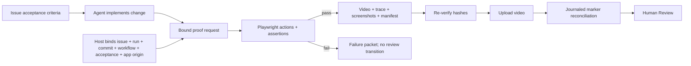

# Visual proof and review packets

## Human model

The agent may propose what to demonstrate, but the host decides what repository, issue, run, app,
and destination are trusted. A short video is recorded while deterministic browser assertions run.
Only a fully passed, hash-verified packet may move an issue to Human Review.

The proof chain is:

`trusted identity → exact commit/workflow/acceptance → bounded plan → post-interaction assertions → checkout recheck → artifact hashes → journaled external handoff`

## What the public evidence proves

**Observed:** OpenAI describes video review packets, proof-of-work video attachment, Chrome DevTools
app driving, end-to-end tests, and QA smoke tests. The public workflow expects app validation and
media, while the public kernel delegates ticket writes to workflow tools. [E-019](EVIDENCE.md#e-019)

**Not verified:** public material does not reveal whether Chrome DevTools recorded the video, how a
packet is structured, how files are bound to a ticket/run, or how upload and state-transition
ambiguity is recovered.

**Observed:** Playwright now directly supports annotated “agentic video receipts,” precise
screencast start/stop, traces, and assertion-aware test evidence. Linear documents private file
upload, comments, state mutations, and URL-idempotent attachments. [E-020](EVIDENCE.md#e-020)

**Recommendation:** use Playwright as the first correctness backend. An optional Chrome DevTools
adapter can add console, network, performance, or existing-browser debugging after the deterministic
path is reliable.

## Why video alone is insufficient

A polished recording can still show the wrong commit, a mocked path, a transient state, or a flow
that looks correct but violates hidden requirements. Each packet therefore needs:

- trusted issue, run, repository, commit, workflow, and target bindings;
- assertion results, not just cursor movement;
- explicit pass/fail state and failure ordinal;
- browser/backend/version and fixed viewport;
- artifact media type, bytes, SHA-256, and private path;
- bounded console/network diagnostics without raw credentials;
- publication operation key, stage, and external IDs;
- a rule that partial upload/comment/transition never becomes “proof passed.”

SHA-256 detects artifact changes relative to the owner-only manifest; it does not authenticate the
host or provide a signed remote attestation.

The checkout recheck samples Git state immediately before and after capture. It rejects a changed
root, commit, dirty bit, tracked diff, or untracked-file digest before manifest creation. A change
that is made and exactly restored between samples, or one in the narrow interval after the final
sample, is not detectable; the future host-owned launch receipt is still required for causal
checkout-to-process binding.

## Implemented slice

`proof/` implements the local deterministic path and a separately gated Linear publisher.
[E-021](EVIDENCE.md#e-021)

| Capability | Current state |
|---|---|
| Commit/dirty-tree binding | Implemented and tested |
| Checkout unchanged throughout capture | Pre/post fingerprint comparison implemented and mutation-tested |
| Loopback-only origin by default | Implemented and tested |
| Action/selector/value/duration/viewport bounds | Implemented and tested |
| Annotated WebM + trace + screenshots | Implemented with real Chromium test |
| Objective post-interaction pass/fail assertions | Implemented and tested |
| Plan/workflow/acceptance/run/commit bindings | Implemented and adversarially tested at publisher boundary |
| Canonical semantic manifest, artifact signatures, and hashes | Implemented and tamper-tested |
| Model-token use by recording harness | Zero by construction; no model client imported |
| Concurrent publication journal and response-loss recovery | Implemented and tested with mock adapter |
| Linear file/comment/state adapter | Official API shape; exact upload headers and bounded comment pagination mock-tested |
| Compact harness cost fields | Wall time, CPU, process peak RSS, media bytes, and assertions implemented |
| Scheduler-bound run envelope | Publisher accepts and rechecks bindings; automatic scheduler injection pending |
| Host-owned app launch receipt | Pending; supplied origin is not yet causally bound to the checkout |
| Live Linear canary | Not run |
| Real product walkthrough | Pending a stable Bethoven UI fixture |

## Token and cost measurement

Do not send video, trace, screenshots, or verbose browser output back into the agent context. The
runner returns only status, manifest path/hash, and zero-token harness accounting. Agents should
read compact scalar fields, never media or trace contents.

Measure these separately:

| Dimension | Metric |
|---|---|
| Agent cost | prompt/tool input and output tokens added to request and consume proof |
| Harness cost | browser wall time, CPU, peak memory, media bytes, upload bytes |
| Evidence quality | passed assertions, stale-binding rejects, false-pass rate, escaped defects |
| Human cost | median review time, requests for rerun, acceptance/rework rate |
| Reliability | capture failures, ambiguous side effects, duplicate comments/transitions |

The target is not “smallest video.” It is lower human review time and higher accepted-work-per-token
without false confidence. Run the same UI fixtures in two cost-capped cohorts: normal text evidence
versus text plus proof packet. Reject the feature if review savings do not exceed runtime/storage
cost or if false passes increase.

## Integration gate

Before enabling automatic publication in Symphony/Bethoven:

1. Bind proof calls to the scheduler's trusted `issue_id` and `run_id`; do not accept either from a
   model tool argument.
2. Bind repository root, expected commit, target origin, state root, and review state in host config.
3. Keep step specs inside the bound workspace and validate their schema/size.
4. Launch the app through a host-owned command with health, deadline, process-group, and cleanup
   controls.
5. Prove a failed assertion cannot publish or transition.
6. Prove restart after comment/state response loss produces one visible side effect. Bethoven's
   bounded marker scan is a recovery mechanism; Linear does not promise idempotent comments.
7. Treat ambiguous upload as blocked; Linear exposes no documented lookup that can reconcile an
   unreferenced signed-file upload safely.
8. Run one disposable live Linear canary, then a small opt-in UI cohort.

## Security and privacy boundary

- Use an isolated browser profile and disposable test account.
- Default to exact loopback origin; external hosts require operator configuration.
- Block service workers, downloads, cross-origin navigation, and unapproved requests.
- Never attach traces to Linear: they can contain DOM, console, and network data.
- Review pixels can themselves contain secrets; use seeded non-production data and retention limits.
- Store packet files and publication journals owner-only outside the issue workspace.
- The agent may request a proof but cannot choose arbitrary host paths, tracker IDs, credentials, or
  review states.

Git history is the archive. Replace this thesis when live canary and cohort evidence contradicts it;
do not append a competing design below it.
