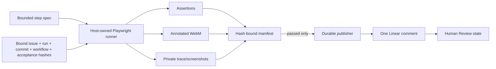

# Bethoven visual proof packets

This optional subsystem records a short browser walkthrough only while it executes explicit,
machine-checkable acceptance steps. It produces a private packet containing an annotated WebM
video, a Playwright trace, screenshots, and a SHA-256-bound manifest. The runner itself invokes no
model, so deterministic proof generation consumes zero model tokens.



## Safety boundary

- The host supplies the repository, target origin, issue ID, run ID, expected commit, workflow hash,
  acceptance-criteria hash, and state root. The JSON spec can describe steps but cannot override
  those bindings; its canonical execution plan receives a separate hash.
- The default network policy permits only the exact loopback target origin. Additional hostnames
  require explicit `--allowed-host` arguments.
- Run artifacts live below an owner-only state root. Traversal and symlink paths are rejected.
- A dirty or stale checkout is rejected unless the host explicitly passes `--allow-dirty`; dirty
  diagnostic runs retain a diff digest and can never be published.
- The same root, commit, dirty bit, tracked diff, and untracked-file digest are sampled again after
  browser cleanup. Any mismatch aborts before manifest creation. This is a two-sample check, not
  remote attestation: mutate-and-restore activity between samples and the narrow interval after the
  final sample remain outside its detection boundary.
- The runner accepts at most 50 steps, 90 seconds, and a 1920x1080 viewport.
- A video is review evidence, not correctness by itself. A packet is `passed` only when every step
  succeeds and an objective assertion follows the last navigation or changed interaction.
- The SHA-256 manifest is tamper evidence inside the owner-only state root, not a cryptographic
  signature or remote attestation.
- Linear publication re-verifies artifact hashes and container signatures, rechecks every host-owned
  identity binding, uploads only the video, performs bounded marker reconciliation across comment
  pages, checks state before transition, and uses an owner-only durable journal. Linear does not
  document idempotent comment creation; response-loss recovery is Bethoven's journaled protocol.
  An ambiguous upload is blocked for operator reconciliation rather than retried.
- Videos and traces may visibly contain application data. Use isolated test accounts and fixtures;
  traces remain local and are never uploaded by the Linear publisher.

## Install and test

Use Node.js 22 or newer and pin Playwright from the lockfile:

```sh
pnpm install --frozen-lockfile
pnpm exec playwright install chromium
pnpm test
```

The browser integration test starts only loopback fixture servers. It verifies WebM, ZIP, and PNG
signatures, semantic manifest invariants, repository/workflow/acceptance/run binding, rejection of a
checkout mutation during capture, zero-token and compact capture-cost accounting, publication retry
behavior, and a paginated mock Linear upload/comment/state flow. It does not contact Linear.

## Record a packet

The spec must be a regular file inside the bound repository. Identity and authority stay in host
arguments:

```sh
node bin/bethoven-proof.mjs \
  --spec /repo/proof.json \
  --state-root /var/lib/bethoven \
  --repository-root /repo \
  --target http://127.0.0.1:4200 \
  --expected-commit 0123456789abcdef0123456789abcdef01234567 \
  --acceptance-criteria-sha256 aaaaaaaaaaaaaaaaaaaaaaaaaaaaaaaaaaaaaaaaaaaaaaaaaaaaaaaaaaaaaaaa \
  --workflow-sha256 bbbbbbbbbbbbbbbbbbbbbbbbbbbbbbbbbbbbbbbbbbbbbbbbbbbbbbbbbbbbbbbb \
  --issue-id MT-893 \
  --run-id run-20260720-001
```

Supported actions are `goto`, `chapter`, `fill`, `click`, `expect_text`, `expect_visible`,
`screenshot`, and a bounded `wait`. Selectors and typed values are used during execution but are not
stored in the manifest; selectors are represented by short hashes and the whole canonical plan is
bound by SHA-256. The runner records wall time, harness CPU, process peak RSS, artifact bytes, and
assertion count in compact scalar fields. These measurements exclude feature-implementation and
proof-spec-authoring model usage.

The runner attaches to the supplied origin; it does not yet prove that the serving process came from
the bound checkout. Start the app with a repository-approved host command and health check. A
host-owned launch receipt remains a scheduler-integration gate before unattended publication.

## Publish to Linear

Publication is a separate, explicit side effect. The token is accepted only through the
`LINEAR_API_KEY` environment variable:

```sh
node bin/bethoven-publish-linear.mjs \
  --run-root /var/lib/bethoven/proof/v1/MT-893/run-20260720-001 \
  --journal-root /var/lib/bethoven/proof-publication \
  --issue-id MT-893 \
  --run-id run-20260720-001 \
  --expected-commit 0123456789abcdef0123456789abcdef01234567 \
  --acceptance-criteria-sha256 aaaaaaaaaaaaaaaaaaaaaaaaaaaaaaaaaaaaaaaaaaaaaaaaaaaaaaaaaaaaaaaa \
  --workflow-sha256 bbbbbbbbbbbbbbbbbbbbbbbbbbbbbbbbbbbbbbbbbbbbbbbbbbbbbbbbbbbbbbbb \
  --review-state-id LINEAR-HUMAN-REVIEW-STATE-UUID \
  --confirm-linear-write
```

Live Linear publication is intentionally not exercised by the repository tests. Validate it first
against a disposable workspace and test issue before enabling it in a workflow.
